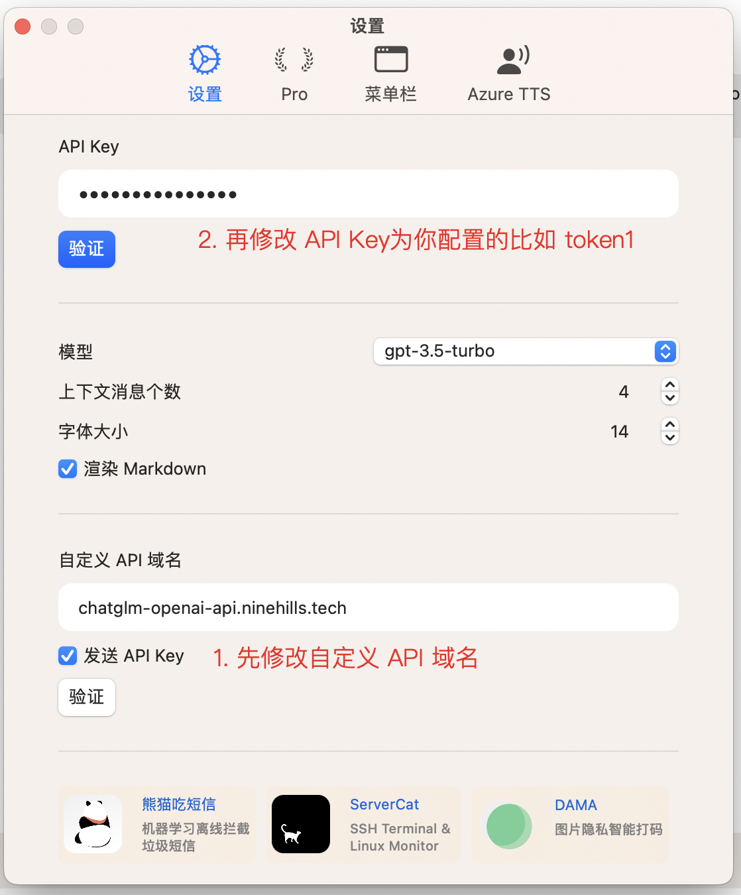
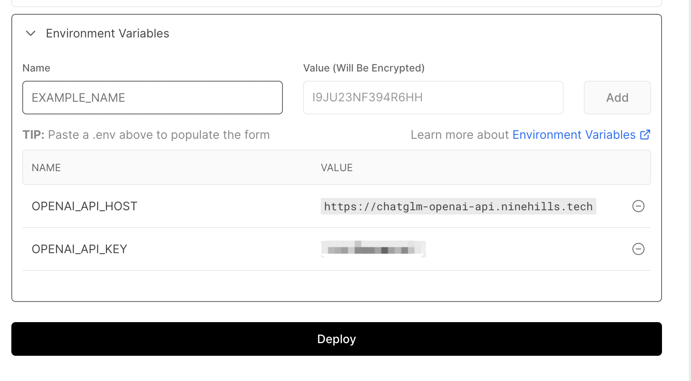

# chatglm-openai-api

Provide OpenAI style API for  ChatGLM-6B and Chinese Embeddings Model

## 更新历史

- 2023-04-26： 支持 `FreedomIntelligence/phoenix-inst-chat-7b` 模型
  - 使用 `--llm_model phoenix-inst-chat-7b/phoenix-inst-chat-7b-int4` 加载

## 注意事项

- 模型托管在 huggingface 上，需要良好的国际互联网访问体验。
- 默认运行在 GPU + CUDA 上。

## 在 Colab 中运行

```python
# 必须首先选择运行时为GPU运行时
!git clone https://github.com/ninehills/chatglm-openai-api.git
!cd chatglm-openai-api && cp config.toml.example config.toml
!cd chatglm-openai-api && python3 main.py --llm_model="chatglm-6b-int4" --tunnel=ngrok --port 8100
```

## 高级功能

### 1. 从本地加载

在 `config.toml` 中，配置模型的 path 为本地目录即可

```toml
    [models.llm."chatglm-6b-int4"]
    type = "chatglm"
    path = "{checkpoint_path}"
```

### 2. 多卡运行推理

使用 `CUDA_VISIBLE_DEVICES` 环境变量，选择运行的 GPU 卡号，并设定运行的 GPU 数量（目前仅对 LLM Model 有效），例如：

```bash
CUDA_VISIBLE_DEVICES=0,1 python main.py --port 8080 --llm_model chatglm-6b-int4 --tunnel ngrok --gpus 2
```

## 本地运行（ngrok 隧道，测试用）

> 注： ngrok 隧道在未付费的时候无法使用自定义域名，只能使用动态域名，仅用来演示  
> ngrok 的 token 和 subdomain，请在 config.toml 中配置

```bash
# 首先初始化虚拟环境
python3 -m venv .venv
source .venv/bin/activate

# 安装依赖
pip install -r requirements.txt

# 复制配置文件
cp config.toml.example config.toml

# 使用 CUDA_VISIBLE_DEVICES 选择运行的 GPU
# llm_model 支持 chatglm-6b、chatglm-6b-int8、chatglm-6b-int4，占用显存从高到低。
CUDA_VISIBLE_DEVICES=0 python main.py --port 8080 --llm_model chatglm-6b-int4 --tunnel ngrok

# 如果想同时包含 Embedding Model，可以使用 --embeddings_model 参数
CUDA_VISIBLE_DEVICES=0 python main.py --port 8080 --llm_model chatglm-6b-int4 --embeddings_model text2vec-large-chinese --tunnel ngrok

# 如果想让 API 一直运行，可以使用 nohup
CUDA_VISIBLE_DEVICES=0 nohup python main.py <args> > nohup.out 2>&1 &
```

运行后，访问显示的 ngrok 隧道地址，即可使用 API，默认输出 `{"hello": "world"}`，该 API 和 OpenAI API 一致。

```bash
# https://platform.openai.com/docs/api-reference/chat/create
export CHATGLM_API_KEY=token1   # API key 配置在 config.toml 中
curl https://<your domain>/v1/chat/completions \
  -H "Content-Type: application/json" \
  -H "Authorization: Bearer $CHATGLM_API_KEY" \
  -d '{
    "model": "gpt-3.5-turbo",
    "messages": [{"role": "user", "content": "Hello!"}]
  }'
```

## 本地运行（cloudflare 隧道，推荐）

前提：需要你已经在 cloudflare 上绑定了域名，且已经配置好了 DNS 解析

首先安装 cloudflare tunnel

```bash
# https://developers.cloudflare.com/cloudflare-one/connections/connect-apps/install-and-setup/tunnel-guide/local/

# 假如 cloudflared 已经安装，路径为 `.cloudflared`
# 首先登录 cloudflare
./cloudflared tunnel login
# 此处需要选择 tunnel 绑定的域名
./cloudflared tunnel create chatglm-openai-api
# 将 tunnel 和你的自定义域名的自域名绑定，这里的 chatglm-openai-api.ninehills.tech 就是你选择的自域名，后续访问这个域名。
./cloudflared tunnel route dns chatglm-openai-api chatglm-openai-api.ninehills.tech
```

然后运行 API

```bash
CUDA_VISIBLE_DEVICES=0 python main.py --port 8080 --llm_model chatglm-6b-int4 --embeddings_model text2vec-large-chinese --tunnel cloudflare
```

这样，你访问 `https://chatglm-openai-api.ninehills.tech` 就可以使用 API 了。

## 常见客户端配置

### OpenCat




### Chatbot-UI

1. Fork `https://github.com/ninehills/chatbot-ui`（去掉了系统 Prompt） 到你的仓库
2. 注册 `https://vercel.com/` 账号
3. `Add new` - `Project` - `Import Git Repository` 选择你 Fork 的仓库
4. 在环境变量部分，填写
    - `OPENAI_API_KEY=token1`，token1 为你的 API key
    - `OPENAI_API_HOST=https://chatglm-openai-api.ninehills.tech`，chatglm-openai-api.ninehills.tech 为你的域名
    - 
5. 点击 `Deploy` 部署
6. 等待部署完成后，点击 `Visit`，即可使用。
